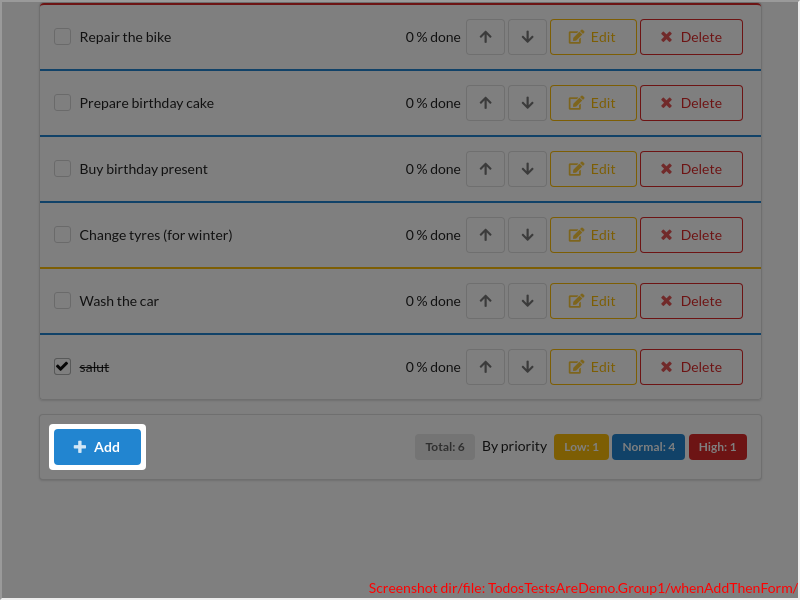

<table>
<tr>
<th>Fig. 1</th>
<th>Fig. 2</th>
<th>Fig. 3</th>
</tr>
<tr>
<td>

Click to expand full image

 

Each TODO is a line in a list. The color on the top corresponds to the **priority**: low = *yellow*, normal = *blue*, red = *high*.

</td>
<td>

Click to expand full image

 

The total for **all** TODOs.

</td>
<td>

Click to expand full image

 

Totals per priority/color.

</td>
</tr>
</table>
<table>
<tr>
<th>Fig. 4</th>
<th>Fig. 5</th>
<th>Fig. 6</th>
</tr>
<tr>
<td>

Click to expand full image

 

To **add a new TODO**: click here to open a form.

</td>
<td>

Click to expand full image

 

Then input the title for the TODO, and maybe other properties as well.

</td>
<td>

Click to expand full image

 

Then click here to add the newly created TODO at the end of the list.

</td>
</tr>
</table>
<table>
<tr>
<th>Fig. 7</th>
<th>Fig. 8</th>
<th>Fig. 9</th>
<th>Fig. 10</th>
</tr>
<tr>
<td>

Click to expand full image

 

Click on the checkbox (or text) to toggle 'done'.

</td>
<td>

Click to expand full image

 

Click here to **change the order** (move up/down). **NOTE:** sorting doesn't take into account the priority.

</td>
<td>

Click to expand full image

 

Click here to **edit** other properties ...

</td>
<td>

Click to expand full image

 

... such as priority, percentage done, etc.

</td>
</tr>
</table>
<table>
<tr>
<th>Fig. 11</th>
<th>Fig. 12</th>
</tr>
<tr>
<td>

Click to expand full image

 

To **delete** a TODO: click here ...

</td>
<td>

Click to expand full image

 

... and then here (within the confirmation dialog).

</td>
</tr>
</table>
