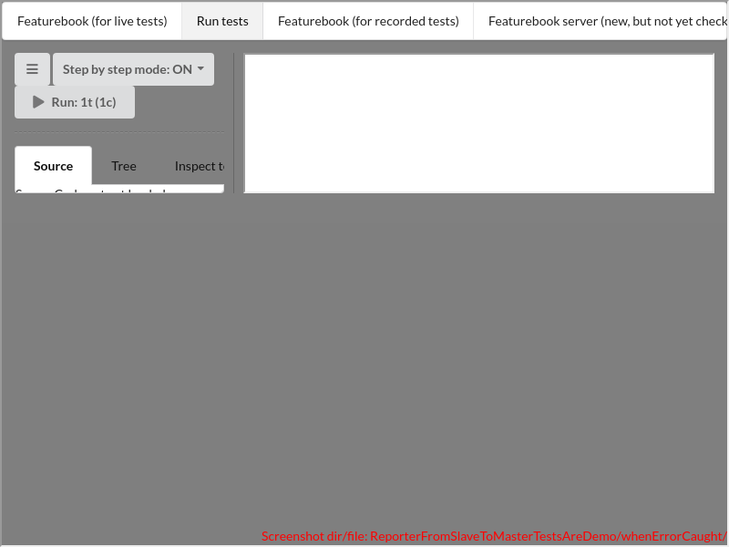
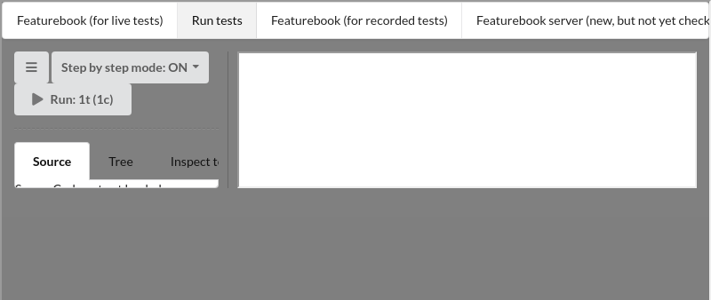

# ReporterFromSlaveToMasterTestsAreDemo/whenErrorCaught()

### undefined

---

There are 1 screenshots. [Go to first](#screenshot-1)

## http://localhost:3000/src/appTestingTadItself/reporterFromSlaveToMaster/ReporterFromSlaveToMasterTestsAreDemo.tsx

<details><summary>Click to expand the hidden lines of code</summary>

```tsx
/* 1*/import React from 'react'; import Sinon, { SinonSpy } from "sinon";
/* 2*/import { Scenario, tad } from "../../lib";
/* 3*/import { ReporterFromSlaveToMaster } from "../../lib/ReporterFromSlaveToMaster";
/* 4*/import { LOCAL_STORAGE_AUTO_RUN, LOCAL_STORAGE_CURRENT_TEST_CLASS, LOCAL_STORAGE_MENU_STATE, LOCAL_STORAGE_TESTS_TO_RUN, MenuState } from "../../lib/TestsAreDemoMaster";
/* 5*/import { BaseTestsAreDemoForTestingTadItself } from "../BaseTestsAreDemoForTestingTadItself";
/* 6*/import { TestsAreDemoMasterCustomForTests } from "../TestsAreDemoMasterCustomForTests";
/* 7*/import { ReporterFromSlaveToMasterTestsAreDemoInnerName } from "./ReporterFromSlaveToMasterTestsAreDemoInner";
/* 8*/
/* 9*/class TestsAreDemoMasterCustomForTestsWithSpy extends TestsAreDemoMasterCustomForTests {
/*10*/
/*11*/    spy!: SinonSpy;
/*12*/
/*13*/    ended: boolean = false;
/*14*/
/*15*/    onMochaReporterCreated(reporter: Mocha.reporters.Base, runner: Mocha.Runner, options: Mocha.MochaOptions): ReporterFromSlaveToMaster {
/*16*/        const that = this;
/*17*/        const result = new class extends ReporterFromSlaveToMaster {
/*18*/
/*19*/            async onTestFail(test: Mocha.Test, err: any): Promise<void> {
/*20*/                await super.onTestFail(test, err);
/*21*/                that.ended = true;
/*22*/            }
/*23*/
/*24*/        }(this, reporter, runner, options);
/*25*/        this.spy = Sinon.spy(result, "consoleLog");
/*26*/        return result;
/*27*/    }
/*28*/    render(): JSX.Element {
/*29*/        return <div data-testid="TestsAreDemoMasterCustomForTestsWithSpy">
/*30*/        {super.render()}
/*31*/        </div>
/*32*/    }
/*33*/}
/*34*/let autoRunValue: string, currentTestClass: string, testsToRun: string, menuState: string;
/*35*/export class ReporterFromSlaveToMasterTestsAreDemo extends BaseTestsAreDemoForTestingTadItself {
/*36*/
/*37*/    async before() {
/*38*/        autoRunValue = localStorage.getItem(LOCAL_STORAGE_AUTO_RUN) as string;
/*39*/        currentTestClass = localStorage.getItem(LOCAL_STORAGE_CURRENT_TEST_CLASS) as string;
/*40*/        testsToRun = localStorage.getItem(LOCAL_STORAGE_TESTS_TO_RUN) as string;
/*41*/        menuState = localStorage.getItem(LOCAL_STORAGE_MENU_STATE) as string;
/*42*/        localStorage.setItem(LOCAL_STORAGE_MENU_STATE, MenuState.TAD.toString());
/*43*/        localStorage.setItem(LOCAL_STORAGE_AUTO_RUN, "false");
/*44*/        localStorage.setItem(LOCAL_STORAGE_CURRENT_TEST_CLASS, JSON.stringify({ ReporterFromSlaveToMasterTestsAreDemoInner: { innerTest: true } }));
/*45*/        localStorage.setItem(LOCAL_STORAGE_TESTS_TO_RUN, JSON.stringify({ ReporterFromSlaveToMasterTestsAreDemoInner: { innerTest: true } }));
/*46*/
/*47*/    }
/*48*/
/*49*/    async after() {
/*50*/        localStorage.setItem(LOCAL_STORAGE_AUTO_RUN, autoRunValue!);
/*51*/        localStorage.setItem(LOCAL_STORAGE_CURRENT_TEST_CLASS, currentTestClass!);
/*52*/        localStorage.setItem(LOCAL_STORAGE_TESTS_TO_RUN, testsToRun!);
/*53*/        localStorage.setItem(LOCAL_STORAGE_MENU_STATE, menuState!);
/*54*/    }
/*55*/
/*56*/    @Scenario("WHEN an error is caught by the reporter (containing a stack trace relative to the minified source being seen by the browser), " +
/*57*/        "THEN it is decoded (using source map) and printed to console, showing function names and line numbers relative to the original source code")
/*58*/    async whenErrorCaught() {
/*59*/        this.renderTadMaster(ReporterFromSlaveToMasterTestsAreDemoInnerName, TestsAreDemoMasterCustomForTestsWithSpy);
/*60*/        tad.waitForCommunicationFinishedNextTimeoutTemp(2500);
/*61*/        await tad.waitForCommunicationFinished();
/*62*/        const comp = tad.getObjectViaCheat(TestsAreDemoMasterCustomForTestsWithSpy);
/*63*/        comp.run(true);
/*64*/        await tad.waitForWhile(() => !comp.ended);
/*65*/        const spy = comp.spy;
/*66*/        tad.screenCapturing.findByTestId("TestsAreDemoMasterCustomForTestsWithSpy");
/*67*/        // The URL from the exception contains a part that is specific to the machine used for build; hence
```

</details>

```tsx
/*68*/        // we want to remove this, to be able to test.
/*69*/        // E.g. in mode dev: http://localhost:3000/home/poweruser/git/foundation-jhipster-gwt/foundation-react/packages/tests-are-demo/src/lib/TestsAreDemoFunctions.tsx:117:29
/*70*/        // E.g. in mode build: http://localhost:????/src/lib/...
/*71*/        // Combining he 2 cases, we want to obtain: src/lib/TestsAreDemoFunctions.tsx
/*72*/        const regex = /(http:.*\/((?=src)))|(:\d+:\d+)|\s/g;
/*73*/
/*74*/        const expected = `Error: Some error
/*75*/at throwError (src/appTestingTadItself/reporterFromSlaveToMaster/ReporterFromSlaveToMasterTestsAreDemoInner2.ts) [throw new Error(message);]
/*76*/at ReporterFromSlaveToMasterTestsAreDemoInner.innerTest (src/appTestingTadItself/reporterFromSlaveToMaster/ReporterFromSlaveToMasterTestsAreDemoInner.ts) [throwError("Some error");]`;
/*77*/        await tad.assertWaitable.equal(spy.args[spy.args.length - 2][0].replaceAll(regex, ""), expected.replaceAll(/\s/g, ""));
```

<table><tr>
<td>

### Screenshot 1


<details><summary>Click to expand full image</summary>

ReporterFromSlaveToMasterTestsAreDemo/whenErrorCaught/TestsAreDemoMasterCustomForTestsWithSpy.png <br/>


</details>
</td>
<td>



</td>
</tr></table>

<details><summary>Click to expand the hidden lines of code</summary>

```tsx
/*78*/    }
/*79*/}
/*80*/
```

</details>
