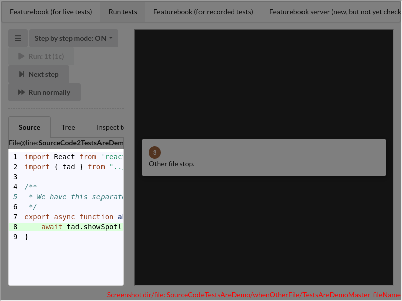

# SourceCodeTestsAreDemo/whenOtherFile()

### undefined

---

There are 8 screenshots. [Go to first](#screenshot-1)

## http://localhost:3000/src/appTestingTadItself/sourceCode/SourceCodeTestsAreDemo.tsx

<details><summary>Click to expand the hidden lines of code</summary>

```tsx
/*  1*/import React from 'react'; import { Utils } from "../../copied/Utils";
/*  2*/import { Scenario, ScenarioOptions, tad } from "../../lib";
/*  3*/import { CURRENT_LINE_BACKGROUND, sourceCodeTestIds } from "../../lib/SourceCode";
/*  4*/import { LOCAL_STORAGE_CURRENT_TEST_CLASS, LOCAL_STORAGE_MENU_STATE, LOCAL_STORAGE_STEP_BY_STEP, LOCAL_STORAGE_TAB_STATE, LOCAL_STORAGE_TESTS_TO_RUN, TabState, testsAreDemoMasterTestids as testids } from "../../lib/TestsAreDemoMaster";
/*  5*/import { BaseTestsAreDemoForTestingTadItself } from "../BaseTestsAreDemoForTestingTadItself";
/*  6*/import { TestsAreDemoMasterCustomForTests } from "../TestsAreDemoMasterCustomForTests";
/*  7*/import { SourceCodeTestsAreDemoInnerName } from "./SourceCodeTestsAreDemoInner";
/*  8*/
/*  9*/const EXPECTED_FULL_CONTENT = `1import React from 'react';
/* 10*/2import { Scenario, tad } from "../../lib";
/* 11*/3import { aFunctionFromAnotherFile } from "./SourceCode2TestsAreDemoInner";
/* 12*/4
/* 13*/5/**
/* 14*/6 * Please avoid modifying this file, because it's used during testing.
/* 15*/7 * But if you do, please modify the EXPECTED_... family of constants from the file SourceCodeTestsAreDemo.
/* 16*/8 */
/* 17*/9export const SourceCodeTestsAreDemoInnerName = "SourceCodeTestsAreDemoInner";
/* 18*/10export class SourceCodeTestsAreDemoInner {
/* 19*/11
/* 20*/12    @Scenario("inner")
/* 21*/13    async inner() {
/* 22*/14        await tad.showSpotlight("First stop");
/* 23*/15        await tad.showSpotlight("Second stop");
/* 24*/16
/* 25*/17        /* 
/* 26*/18         * These lines are empty on purpose, to test the scroll feature.
/* 27*/19         * We add a lot of them hoping to be robust in case different browsers
/* 28*/20         * render w/ slightly different amount of pixels.
/* 29*/21         * 
/* 30*/22         * 
/* 31*/23         * 
/* 32*/24         * 
/* 33*/25         * 
/* 34*/26         * 
/* 35*/27         * 
/* 36*/28         * 
/* 37*/29         * 
/* 38*/30         * 
/* 39*/31         * 
/* 40*/32         * 
/* 41*/33         * 
/* 42*/34         * 
/* 43*/35         */
/* 44*/36        await tad.showSpotlight("Third stop");
/* 45*/37        await aFunctionFromAnotherFile();
/* 46*/38    }
/* 47*/39
/* 48*/40
/* 49*/41
/* 50*/42
/* 51*/43
/* 52*/44
/* 53*/45
/* 54*/46
/* 55*/47
/* 56*/48
/* 57*/49
/* 58*/50
/* 59*/51
/* 60*/52
/* 61*/53
/* 62*/54
/* 63*/55
/* 64*/56
/* 65*/57
/* 66*/58
/* 67*/59}`;
/* 68*/
/* 69*/const EXPECTED_TESTID1 = sourceCodeTestIds.line + "_1";
/* 70*/const EXPECTED_TESTID2 = sourceCodeTestIds.line + "_14";
/* 71*/const EXPECTED_TESTID3 = sourceCodeTestIds.line + "_15";
/* 72*/const EXPECTED_TESTID4 = sourceCodeTestIds.line + "_35";
/* 73*/const EXPECTED_TESTID5 = sourceCodeTestIds.line + "_36";
/* 74*/const EXPECTED_TESTID6 = sourceCodeTestIds.line + "_15";
/* 75*/const EXPECTED_FILE_NAME = "SourceCodeTestsAreDemoInner.tsx";
/* 76*/
/* 77*/const EXPECTED_FULL_OTHER_CONTENT = `1import React from 'react'; 
/* 78*/2import { tad } from "../../lib";
/* 79*/3
/* 80*/4/**
/* 81*/5 * We have this separate file, to have an other file in source code, for "whenOtherFile" test.
/* 82*/6 */
/* 83*/7export async function aFunctionFromAnotherFile() {
/* 84*/8    await tad.showSpotlight("Other file stop.");
/* 85*/9}`;
/* 86*/
/* 87*/const EXPECTED_OTHER_TESTID1 = sourceCodeTestIds.line + "_1";
/* 88*/const EXPECTED_OTHER_TESTID2 = sourceCodeTestIds.line + "_8";
/* 89*/
/* 90*/const EXPECTED_OTHER_FILE_NAME = "SourceCode2TestsAreDemoInner.tsx";
/* 91*/
/* 92*/let stepByStepValue: string, menuState: string, tabState: string, currentTestClass: string, testsToRun: string;
/* 93*/
/* 94*/export class SourceCodeTestsAreDemo extends BaseTestsAreDemoForTestingTadItself {
/* 95*/
/* 96*/    async before() {
/* 97*/        stepByStepValue = localStorage.getItem(LOCAL_STORAGE_STEP_BY_STEP) as string;
/* 98*/        menuState = localStorage.getItem(LOCAL_STORAGE_MENU_STATE) as string;
/* 99*/        tabState = localStorage.getItem(LOCAL_STORAGE_TAB_STATE) as string;
/*100*/        currentTestClass = localStorage.getItem(LOCAL_STORAGE_CURRENT_TEST_CLASS) as string;
/*101*/        testsToRun = localStorage.getItem(LOCAL_STORAGE_TESTS_TO_RUN) as string;
/*102*/        localStorage.setItem(LOCAL_STORAGE_TAB_STATE, TabState.SRC.toString());
/*103*/        localStorage.setItem(LOCAL_STORAGE_STEP_BY_STEP, "true");
/*104*/        localStorage.setItem(LOCAL_STORAGE_TESTS_TO_RUN, JSON.stringify({ SourceCodeTestsAreDemoInner: { inner: true } }));
/*105*/        localStorage.setItem(LOCAL_STORAGE_MENU_STATE, JSON.stringify({ SourceCodeTestsAreDemoInner: { inner: true } }));
/*106*/
/*107*/        this.renderTadMaster(SourceCodeTestsAreDemoInnerName);
/*108*/        tad.waitForCommunicationFinishedNextTimeoutTemp(3000);
/*109*/        await tad.waitForCommunicationFinished();
/*110*/        tad.getObjectViaCheat(TestsAreDemoMasterCustomForTests).run(true);
/*111*/    }
/*112*/
/*113*/    async after() {
/*114*/        localStorage.setItem(LOCAL_STORAGE_STEP_BY_STEP, stepByStepValue!);
/*115*/        localStorage.setItem(LOCAL_STORAGE_MENU_STATE, menuState!);
/*116*/        localStorage.setItem(LOCAL_STORAGE_TESTS_TO_RUN, testsToRun!);
/*117*/        localStorage.setItem(LOCAL_STORAGE_MENU_STATE, menuState!);
/*118*/        localStorage.setItem(LOCAL_STORAGE_TAB_STATE, tabState!);
/*119*/    }
/*120*/
/*121*/    @ScenarioOptions({ linkWithNextScenario: true })
/*122*/    @Scenario("WHEN execution is halted (i.e. spotlight shown and waiting to press 'Next step', THEN the source code is shown, AND current line is highlighted")
/*123*/    async whenSpotlightThenHighlight() {
/*124*/        await this.waitUntilNextStepAvailable();
/*125*/        tad.cc("The file name is " + EXPECTED_FILE_NAME);
/*126*/        await tad.assertWaitable.equal(tad.screenCapturing.getByTestId(sourceCodeTestIds.fileName).textContent, EXPECTED_FILE_NAME);
/*127*/        tad.cc("We verify that the source code has correctly loaded");
/*128*/        await tad.assertWaitable.equal(tad.screenCapturing.getByTestId(sourceCodeTestIds.code).textContent, EXPECTED_FULL_CONTENT);
/*129*/        tad.cc("The first line isn't selected");
/*130*/        await tad.assertWaitable.notEqual(tad.screenCapturing.getByTestId(EXPECTED_TESTID1).style.backgroundColor, CURRENT_LINE_BACKGROUND);
/*131*/        tad.cc("The current line is selected");
/*132*/        await tad.assertWaitable.equal(tad.screenCapturing.getByTestId(EXPECTED_TESTID2).style.backgroundColor, CURRENT_LINE_BACKGROUND);
/*133*/        const currentLineNumber = Utils.substringAfter(EXPECTED_TESTID2, "_", true);
/*134*/        tad.cc("The current line number is " + currentLineNumber);
/*135*/        await tad.assertWaitable.equal(tad.screenCapturing.getByTestId(sourceCodeTestIds.lineNumber).textContent, currentLineNumber);
/*136*/    }
/*137*/
/*138*/    @ScenarioOptions({ linkWithNextScenario: true })
/*139*/    @Scenario("WHEN clicked on 'Next step', AND the next line is pretty NEAR to the previous one, AND halted, THEN the new line is highlighted, AND no scroll is performed")
/*140*/    async whenSpotlightThenHighlight2() {
/*141*/        await this.clickOnNextStep();
/*142*/        tad.cc("The previous line isn't selected");
/*143*/        await tad.assertWaitable.notEqual(tad.screenCapturing.getByTestId(EXPECTED_TESTID2).style.backgroundColor, CURRENT_LINE_BACKGROUND);
/*144*/        tad.cc("The current line is selected");
/*145*/        await tad.assertWaitable.equal(tad.screenCapturing.getByTestId(EXPECTED_TESTID3).style.backgroundColor, CURRENT_LINE_BACKGROUND);
/*146*/        const currentLineNumber = Utils.substringAfter(EXPECTED_TESTID3, "_", true);
/*147*/        tad.cc("The current line number is " + currentLineNumber);
/*148*/        await tad.assertWaitable.equal(tad.screenCapturing.getByTestId(sourceCodeTestIds.lineNumber).textContent, currentLineNumber);
/*149*/        tad.cc("We verify if no scroll is performed, the first line is in view");
/*150*/        await tad.assertWaitable.exists(tad.screenCapturing.getByTestId(EXPECTED_TESTID1));
/*151*/    }
/*152*/
/*153*/    @ScenarioOptions({ linkWithNextScenario: true })
/*154*/    @Scenario("WHEN clicked on 'Next step', AND next line is FAR from the previous one, AND halted, THEN highlight, AND scroll is performed so that the next line is visible")
/*155*/    async whenFarLineThenScrollAndHighlight() {
/*156*/        // we do a trick to make scrolling independent of browser height: we force it small; and later, we'll restore
/*157*/        const maxHeight = document.getElementById("SyntaxHighlighter")!.style.maxHeight;
/*158*/        document.getElementById("SyntaxHighlighter")!.style.maxHeight = tad.screenCapturing.getByTestId(EXPECTED_TESTID6).offsetTop + "px";
/*159*/        const currentLineNumber = Utils.substringAfter(EXPECTED_TESTID1, "_", true);
/*160*/        tad.cc("The first visible line is " + currentLineNumber);
/*161*/        await tad.assertWaitable.equal(tad.screenCapturing.getByTestId(EXPECTED_TESTID1).querySelector(".linenumber")!.textContent, currentLineNumber);
/*162*/        tad.cc("The previous line is " + Utils.substringAfter(EXPECTED_TESTID3, "_", true));
/*163*/        await tad.assertWaitable.equal(tad.screenCapturing.getByTestId(EXPECTED_TESTID3).style.backgroundColor, CURRENT_LINE_BACKGROUND);
/*164*/
/*165*/        await this.clickOnNextStep();
/*166*/        const firstLineNumber = Utils.substringAfter(EXPECTED_TESTID4, "_", true);
/*167*/        tad.cc("The first visible line is " + firstLineNumber + ", it means that the scroll was performed");
/*168*/        await tad.assertWaitable.equal(tad.screenCapturing.getByTestId(EXPECTED_TESTID4).querySelector(".linenumber")!.textContent, firstLineNumber);
/*169*/        const secondLineNumber = Utils.substringAfter(EXPECTED_TESTID5, "_", true);
/*170*/        tad.cc("The second line is " + secondLineNumber + " it means the scroll have an offset of line on scroll");
```

</details>

```tsx
/*171*/        await tad.assertWaitable.equal(tad.screenCapturing.getByTestId(EXPECTED_TESTID5).style.backgroundColor, CURRENT_LINE_BACKGROUND);
/*172*/        tad.cc("The current line number is " + secondLineNumber);
/*173*/        await tad.assertWaitable.equal(tad.screenCapturing.getByTestId(sourceCodeTestIds.lineNumber).textContent, secondLineNumber);
/*174*/
/*175*/        document.getElementById("SyntaxHighlighter")!.style.maxHeight = maxHeight;
/*176*/    }
/*177*/
/*178*/    @Scenario("WHEN 'Next step', AND the new line is in a different file, AND halted, THEN a new source code is shown, AND highlight")
/*179*/    async whenOtherFile() {
/*180*/        await this.clickOnNextStep();
```

<table><tr>
<td>

### Screenshot 1

 [Go to next](#screenshot-2)

<details><summary>Click to expand full image</summary>

SourceCodeTestsAreDemo/whenOtherFile/TestsAreDemoMaster_nextStep.png <br/>


</details>
</td>
<td>


</td>
</tr></table>

```tsx
/*181*/        tad.cc("The file name is " + EXPECTED_OTHER_FILE_NAME);
/*182*/        await tad.assertWaitable.equal(tad.screenCapturing.getByTestId(sourceCodeTestIds.fileName).textContent, EXPECTED_OTHER_FILE_NAME);
```

<table><tr>
<td>

### Screenshot 2

[Go to previous](#screenshot-1) |  [Go to next](#screenshot-3)

<details><summary>Click to expand full image</summary>

SourceCodeTestsAreDemo/whenOtherFile/TestsAreDemoMaster_fileName.png <br/>


</details>
</td>
<td>


</td>
</tr></table>

```tsx
/*183*/        const code = tad.screenCapturing.getByTestId(sourceCodeTestIds.code);
/*184*/
/*185*/        tad.cc("We check if the source code is different from the first file");
/*186*/        await tad.assertWaitable.notEqual(code.textContent, EXPECTED_FULL_CONTENT);
```

<table><tr>
<td>

### Screenshot 3

[Go to previous](#screenshot-2) |  [Go to next](#screenshot-4)

<details><summary>Click to expand full image</summary>

SourceCodeTestsAreDemo/whenOtherFile/TestsAreDemoMaster_code.png <br/>


</details>
</td>
<td>


</td>
</tr></table>

```tsx
/*187*/        tad.cc("We verify that the source code has correctly loaded");
/*188*/        await tad.assertWaitable.equal(code.textContent, EXPECTED_FULL_OTHER_CONTENT);
```

<table><tr>
<td>

### Screenshot 4

[Go to previous](#screenshot-3) |  [Go to next](#screenshot-5)

<details><summary>Click to expand full image</summary>

SourceCodeTestsAreDemo/whenOtherFile/TestsAreDemoMaster_code_REP1.png <br/>


</details>
</td>
<td>


</td>
</tr></table>

```tsx
/*189*/
/*190*/        tad.cc("The first line isn't selected");
/*191*/        await tad.assertWaitable.notEqual(tad.screenCapturing.getByTestId(EXPECTED_OTHER_TESTID1).style.backgroundColor, CURRENT_LINE_BACKGROUND);
```

<table><tr>
<td>

### Screenshot 5

[Go to previous](#screenshot-4) |  [Go to next](#screenshot-6)

<details><summary>Click to expand full image</summary>

SourceCodeTestsAreDemo/whenOtherFile/TestsAreDemoMaster_code_TestsAreDemoMaster_line_1.png <br/>


</details>
</td>
<td>


</td>
</tr></table>

```tsx
/*192*/        await tad.assertWaitable.equal(tad.screenCapturing.getByTestId(EXPECTED_OTHER_TESTID2).style.backgroundColor, CURRENT_LINE_BACKGROUND);
```

<table><tr>
<td>

### Screenshot 6

[Go to previous](#screenshot-5) |  [Go to next](#screenshot-7)

<details><summary>Click to expand full image</summary>

SourceCodeTestsAreDemo/whenOtherFile/TestsAreDemoMaster_code_TestsAreDemoMaster_line_8.png <br/>


</details>
</td>
<td>


</td>
</tr></table>

```tsx
/*193*/        const currentLineNumber = Utils.substringAfter(EXPECTED_OTHER_TESTID2, "_", true);
/*194*/        tad.cc("The current line number is " + currentLineNumber);
/*195*/        await tad.assertWaitable.equal(tad.screenCapturing.getByTestId(sourceCodeTestIds.lineNumber).textContent, currentLineNumber);
```

<table><tr>
<td>

### Screenshot 7

[Go to previous](#screenshot-6) |  [Go to next](#screenshot-8)

<details><summary>Click to expand full image</summary>

SourceCodeTestsAreDemo/whenOtherFile/TestsAreDemoMaster_lineNumber.png <br/>


</details>
</td>
<td>


</td>
</tr></table>

```tsx
/*196*/        // finish run
/*197*/        tad.demoForEndUserHideNext();
/*198*/        await this.clickOnNextStep(false);
```

<table><tr>
<td>

### Screenshot 8

[Go to previous](#screenshot-7)

<details><summary>Click to expand full image</summary>

SourceCodeTestsAreDemo/whenOtherFile/TestsAreDemoMaster_nextStep_REP1.png <br/>


</details>
</td>
<td>


</td>
</tr></table>

<details><summary>Click to expand the hidden lines of code</summary>

```tsx
/*199*/    }
/*200*/}
```

</details>
