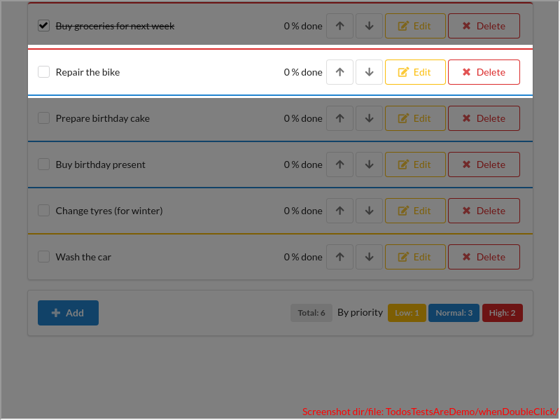
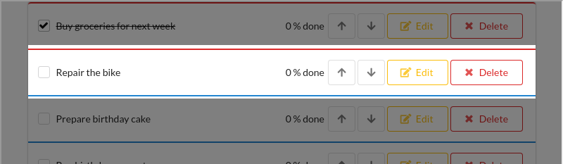
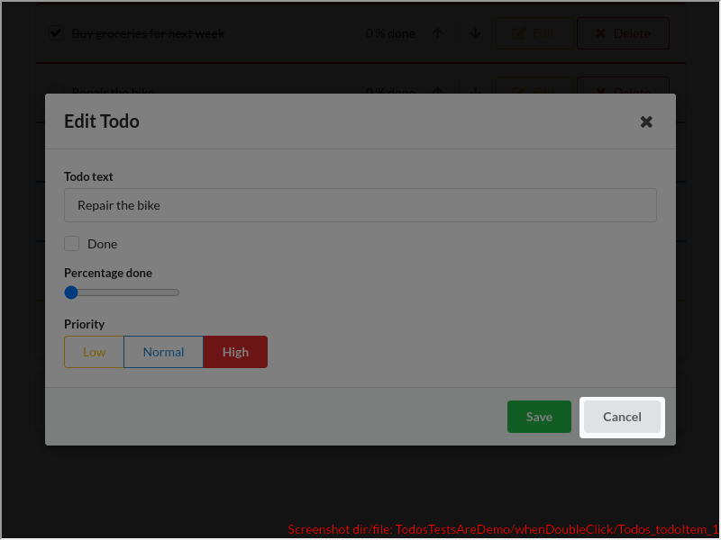
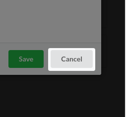
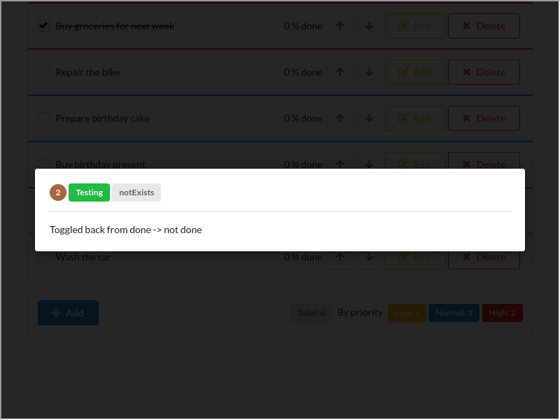

# TodosTestsAreDemo/whenDoubleClick()

### undefined

---

There are 3 screenshots. [Go to first](#screenshot-1)

## TodosTestsAreDemo.tsx

<details><summary>Click to expand the hidden lines of code</summary>

```tsx
/*  1*/import React from 'react'; import { Utils } from "../../copied/Utils";
/*  2*/import { tad } from "../../lib";
/*  3*/import { Comment, Only, Scenario } from "../../lib/decorators";
/*  4*/import { render } from "../../lib/reactTestingLibraryCustomized";
/*  5*/import { uiApiTodoForm } from "./TodoForm";
/*  6*/import { uiApiTodoItem } from "./TodoItem";
/*  7*/import { Priority, Todos, colorHigh, colorLow, colorNormal, entities, fields, someTodos, todosTestids as testids, uiApiTodos } from "./Todos";
/*  8*/
/*  9*/export class TodosTestsAreDemo {
/* 10*/
/* 11*/    async before() {
/* 12*/        // TODO experimental; we use this in only 2 places for the moment
/* 13*/        await tad.miniDb.clear()
/* 14*/            .populate("Todo", 1, 3);
/* 15*/
/* 16*/        render(<Todos />);
/* 17*/        await tad.waitForCommunicationFinished();
/* 18*/    }
/* 19*/
/* 20*/    @Comment("Todos (func comp)")
/* 21*/    @Scenario("SCREEN Todos")
/* 22*/    async screenTodos() {
/* 23*/        let item = tad.screenCapturing.getByTestId(testids.todoItem + "_0")
/* 24*/        tad.cc("`Todo.priority` -> color of the top border");
/* 25*/        await tad.assertWaitable.include(item.className, tad.miniDb.getDerived(entities.Todo, 1, fields.Todo.priority, colorHigh));
/* 26*/        tad.cc("`Todo.text`");
/* 27*/        let label = tad.screenCapturing.getByTestId(uiApiTodoItem(0).testids.onToggle);
/* 28*/        await tad.assertWaitable.equal(label.textContent, tad.miniDb.get(entities.Todo, 1, fields.Todo.text)); // or maybe: tad.miniDb.get(entities.Todo, 1, e => e.text)
/* 29*/        tad.cc("`Todo.done`: when `true`, we 'line through' the text");
/* 30*/        await tad.assertWaitable.equal(label.style.textDecoration, tad.miniDb.getDerived(entities.Todo, 1, fields.Todo.done, "line-through"));
/* 31*/        tad.cc("`Todo.done`: when `true` we check the checkbox");
/* 32*/        await tad.assertWaitable.equal(tad.withinCapturing(item).getByRole<HTMLInputElement>('checkbox').checked, tad.miniDb.getDerived(entities.Todo, 1, fields.Todo.done, true));
/* 33*/
/* 34*/        tad.demoForEndUserHide();
/* 35*/        item = tad.screenCapturing.getByTestId(testids.todoItem + "_2")
/* 36*/        tad.cc("`Todo.priority` -> color of the top border");
/* 37*/        await tad.assertWaitable.include(item.className, colorNormal);
/* 38*/        tad.cc("`Todo.text`");
/* 39*/        label = tad.screenCapturing.getByTestId(uiApiTodoItem(2).testids.onToggle);
/* 40*/        await tad.assertWaitable.equal(label.textContent, tad.miniDb.get(entities.Todo, 3, fields.Todo.text));
/* 41*/        tad.cc("`Todo.done`: when `false`, we don't 'line through' the text");
/* 42*/        await tad.assertWaitable.notEqual(label.style.textDecoration, "line-through");
/* 43*/        tad.cc("`Todo.done`: and we uncheck the checkbox");
/* 44*/        await tad.assertWaitable.isFalse(tad.withinCapturing(item).getByRole<HTMLInputElement>('checkbox').checked);
/* 45*/        tad.demoForEndUserShow();
/* 46*/
/* 47*/        tad.cc("Total number of Todos");
/* 48*/        await tad.assertWaitable.equal(tad.screenCapturing.getByTestId(testids.total).textContent, "6")
/* 49*/        tad.cc("Number of Todos w/ priority = Low");
/* 50*/        await tad.assertWaitable.equal(tad.screenCapturing.getByTestId(testids.totalLow).textContent, "1")
/* 51*/        tad.cc("Number of Todos w/ priority = Normal");
/* 52*/        await tad.assertWaitable.equal(tad.screenCapturing.getByTestId(testids.totalNormal).textContent, "3")
/* 53*/        tad.cc("Number of Todos w/ priority = High");
/* 54*/        await tad.assertWaitable.equal(tad.screenCapturing.getByTestId(testids.totalHigh).textContent, "2")
/* 55*/    }
/* 56*/
/* 57*/    group1() {
/* 58*/        class Group1 {
/* 59*/
/* 60*/            @Scenario("WHEN click on Add, THEN the form opens")
/* 61*/            async whenAddThenForm() {
/* 62*/                tad.cc("Let's add a new Todo");
/* 63*/                await uiApiTodos().dispatcher.onAdd();
/* 64*/            }
/* 65*/
/* 66*/            @Scenario("FORM for a Todo; test #1")
/* 67*/            async formTodo1() {
/* 68*/                tad.cc("Please observe that this text field is already focused. So you can directly start typing, w/o needing to click here first");
/* 69*/                await this.createNewTodo();
/* 70*/
/* 71*/                tad.cc("The newly added Todo appears at the bottom of the list");
/* 72*/                let label = tad.screenCapturing.getByTestId(uiApiTodoItem(6).testids.onToggle);
/* 73*/                await tad.assertWaitable.equal(label.textContent, "My task");
/* 74*/            }
/* 75*/
/* 76*/            // I created this helper function UNDERNEATH the calling function to see how the screenshots are arranged in the MD report
/* 77*/            private async createNewTodo() {
/* 78*/                const textbox = tad.withinCapturing(tad.screenCapturing.getByTestId(uiApiTodoForm().testids.onChangeText)).getByRole('textbox');
/* 79*/                tad.demoForEndUserHideNext(); // hiding this check because the object from the verification is ugly and not meaningful
/* 80*/
/* 81*/                await tad.assertWaitable.equal(document.activeElement, textbox);
/* 82*/
/* 83*/                await this.anotherDummyHelperFunction();
/* 84*/                await this.anotherDummyHelperFunction();
/* 85*/
/* 86*/                // TODO: crapa in step by step, caci e spotlight-ul de "will type", "was typed", si atunci incearca si uiapi sa arate cate un spotlight pt fiecare caracter
/* 87*/                // nu stiu de ce crapa in modul normal; nu vad erori in consola
/* 88*/                // await tad.userEventWaitable.type(textbox, "My task");
/* 89*/                await uiApiTodoForm().dispatcher.onChangeText("My task");
/* 90*/                await uiApiTodoForm().dispatcher.onSave();
/* 91*/            }
/* 92*/
/* 93*/            // this doeasn't test anything; it's here to illustrate 2 screenshots that belong to the same line
/* 94*/            private async anotherDummyHelperFunction() {
/* 95*/                const textbox = tad.withinCapturing(tad.screenCapturing.getByTestId(uiApiTodoForm().testids.onChangeText)).getByRole('textbox');
/* 96*/                await tad.assertWaitable.isTrue(true);
/* 97*/            }
/* 98*/        }
/* 99*/        return Group1;
/*100*/    }
/*101*/
/*102*/    @Comment("TodoItem (func comp)")
/*103*/    @Scenario("WHEN click on checkbox or label, THEN toggle 'done'")
/*104*/    async whenCheckbox() {
/*105*/        let item = tad.screenCapturing.getByTestId(testids.todoItem + "_1");
/*106*/
/*107*/        tad.cc("When we solve the Todo, we click on the text or checkbox")
/*108*/        await uiApiTodoItem(1).dispatcher.onToggle();
/*109*/        tad.cc("The checkbox becomes checked, and the text is 'line-through'");
/*110*/        await tad.assertWaitable.isTrue(tad.withinCapturing(item).getByRole<HTMLInputElement>('checkbox').checked);
/*111*/
/*112*/        tad.demoForEndUserHide();
/*113*/        await uiApiTodoItem(1).dispatcher.onToggle();
/*114*/        tad.cc("Toggled back from done -> not done");
/*115*/        await tad.assertWaitable.isFalse(tad.withinCapturing(item).getByRole<HTMLInputElement>('checkbox').checked);
/*116*/    }
/*117*/
/*118*/    group2() {
/*119*/        class Group2 {
/*120*/
/*121*/            @Scenario("WHEN click on UP, THEN the Todo slides up")
/*122*/            async whenUp() {
/*123*/                tad.cc(`We may move the Todo up. Now 'Repair the bike' is the second`);
/*124*/                await uiApiTodoItem(1).dispatcher.onUp();
/*125*/                tad.cc(`And after clicking, it moved up, so 'Repair the bike' is the first`);
/*126*/                await tad.assertWaitable.equal(tad.screenCapturing.getByTestId(uiApiTodoItem(0).testids.onToggle).textContent, "Repair the bike");
/*127*/            }
/*128*/
/*129*/            @Scenario("WHEN click on DOWN, THEN the Todo slides down")
/*130*/            async whenDown() {
/*131*/                await uiApiTodoItem(0).dispatcher.onDown();
/*132*/                tad.cc("Element [0] moved down and is now element [1], as in the initial setup");
```

</details>

```tsx
/*133*/                await tad.assertWaitable.equal(tad.screenCapturing.getByTestId(uiApiTodoItem(0).testids.onToggle).textContent, "Buy groceries for next week");
/*134*/            }
/*135*/        }
/*136*/        return Group2;
/*137*/    }
/*138*/
/*139*/    @Scenario("WHEN double click on a Todo, THEN the form opens")
/*140*/    async whenDoubleClick() {
/*141*/        tad.demoForEndUserHide();
/*142*/        await tad.userEventWaitable.dblClick(tad.screenCapturing.getByTestId(testids.todoItem + "_1"));
```

<table><tr>
<td>

### Screenshot 1

 [Go to next](#screenshot-2)

<details><summary>Click to expand full image</summary>

TodosTestsAreDemo/whenDoubleClick/Todos_todoItem_1.png <br/>


</details>
</td>
<td>



</td>
</tr></table>

```tsx
/*143*/        await tad.screenCapturing.findByTestId(testids.form); 
/*144*/        
/*145*/        await uiApiTodoForm().dispatcher.onClose();
```

<table><tr>
<td>

### Screenshot 2

[Go to previous](#screenshot-1) |  [Go to next](#screenshot-3)

<details><summary>Click to expand full image</summary>

TodosTestsAreDemo/whenDoubleClick/TodoForm__onClose.png <br/>


</details>
</td>
<td>



</td>
</tr></table>

```tsx
/*146*/        await tad.assertWaitable.notExists(tad.screenCapturing.queryByTestId(testids.form));
```

<table><tr>
<td>

### Screenshot 3

[Go to previous](#screenshot-2)

<details><summary>Click to expand full image</summary>

TodosTestsAreDemo/whenDoubleClick/_LAP.png <br/>


</details>
</td>
<td>


</td>
</tr></table>

<details><summary>Click to expand the hidden lines of code</summary>

```tsx
/*147*/    }
/*148*/
/*149*/    group3() {
/*150*/        class Group3 {
/*151*/
/*152*/            @Scenario("WHEN click on Edit, THEN the form opens")
/*153*/            async whenEditThenForm() {
/*154*/                tad.cc("A Todo may be edited");
/*155*/                await uiApiTodoItem(1).dispatcher.onEdit();
/*156*/            }
/*157*/
/*158*/            @Comment("TodoForm (func comp)")
/*159*/            @Scenario("FORM for a Todo; test #2")
/*160*/            async formTodo2() {
/*161*/                await uiApiTodoForm().dispatcher.onChangeText("Repair the bike; some updates");
/*162*/
/*163*/                tad.cc("We may check/uncheck for the editor as well");
/*164*/                await uiApiTodoForm().dispatcher.onChangeDone();
/*165*/
/*166*/                tad.cc("We also have the notion of priority");
/*167*/                await uiApiTodoForm().dispatcher.onChangePriority(Priority.LOW);
/*168*/                await uiApiTodoForm().dispatcher.onSave();
/*169*/
/*170*/                let item = tad.screenCapturing.getByTestId(testids.todoItem + "_1");
/*171*/                tad.cc("The Todo was updated");
/*172*/                const label = tad.screenCapturing.getByTestId(uiApiTodoItem(1).testids.onToggle);
/*173*/                await tad.assertWaitable.equal(label.textContent, someTodos[1].text + "; some updates");
/*174*/                tad.demoForEndUserHide();
/*175*/                await tad.assertWaitable.include(item.className, colorLow);
/*176*/                await tad.assertWaitable.equal(label.style.textDecoration, "line-through");
/*177*/                await tad.assertWaitable.isTrue(tad.withinCapturing(item).getByRole<HTMLInputElement>('checkbox').checked);
/*178*/            }
/*179*/
/*180*/        }
/*181*/        return Group3;
/*182*/    }
/*183*/
/*184*/    @Comment("TodoItem again")
/*185*/    @Scenario("WHEN click on DELETE, THEN confirm, AND WHEN 'yes', THEN the Todo is removed")
/*186*/    async whenDelete() {
/*187*/        tad.cc("A Todo may be deleted");
/*188*/
/*189*/        tad.demoForEndUserHide();
/*190*/        await uiApiTodoItem(0).dispatcher.onDelete();
/*191*/        await uiApiTodoItem(0).dispatcher.onDeleteNo();
/*192*/
/*193*/        tad.cc("The Todo wasn't deleted");
/*194*/        await tad.assertWaitable.equal(tad.screenCapturing.getByTestId(uiApiTodoItem().testids.onToggle).textContent, someTodos[0].text);
/*195*/        tad.demoForEndUserShow();
/*196*/
/*197*/        await uiApiTodoItem(0).dispatcher.onDelete();
/*198*/        await uiApiTodoItem(0).dispatcher.onDeleteYes();
/*199*/
/*200*/        tad.cc("The Todo was deleted. So the second element (index 1) became element the first element (index 0)");
/*201*/        await tad.assertWaitable.include(tad.screenCapturing.getByTestId(uiApiTodoItem(0).testids.onToggle).textContent, someTodos[1].text); // include instead of equals, because we appended something in a step above
/*202*/    }
/*203*/
/*204*/    @Scenario("")
/*205*/    async uiApiSampleScript() {
/*206*/        await uiApiTodos().dispatcher.onAdd();
/*207*/        await uiApiTodoForm().dispatcher.onChangeText("salut");
/*208*/        await uiApiTodoForm().dispatcher.onChangeDone();
/*209*/        await uiApiTodoForm().dispatcher.onSave();
/*210*/
/*211*/        await uiApiTodos().dispatcher.onAdd();
/*212*/        await uiApiTodoForm().dispatcher.onClose();
/*213*/    }
/*214*/}
/*215*/
```

</details>
